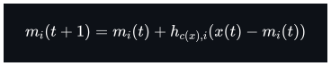
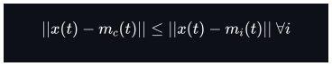
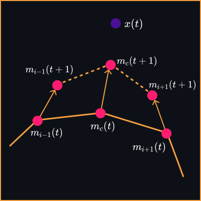
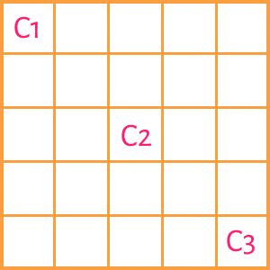
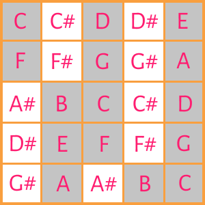
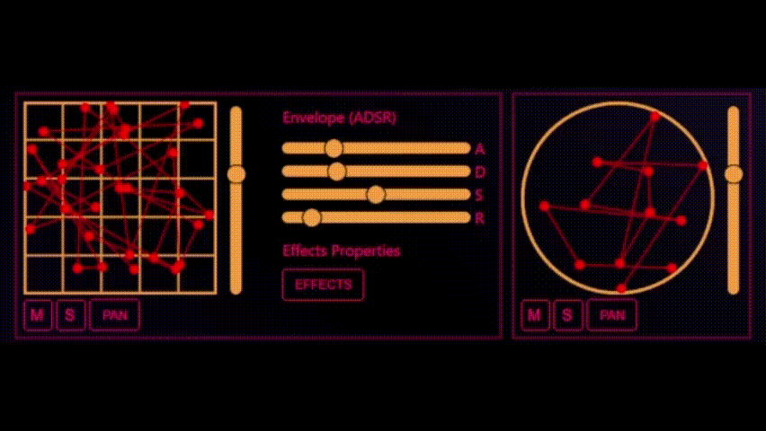

# Blob.

<p align="center">
  
</p>


<!--  -->

## General infos
---

Blob is a project developed for the course Advance Coding Tools and Methodologies, held in the Master degree of [Music and Acoustic Engineering](https://www.poliorientami.polimi.it/cosa-si-studia/corsi-di-laurea-magistrale/ingegneria/music-and-acoustic-engineering/), based in PoliMi. <br>
<br>
To run the project just type this line in the project folder: <br>
```
npm install
npx parcel src/prj.html --no-cache
```

The idea driving the project is the sonification of Kohonen Networks (KN). <br>

We implemented the following web frameworks: <br> 
- [Tone.js](https://tonejs.github.io/) <br>
- [Canvas API](https://developer.mozilla.org/en-US/docs/Web/API/Canvas_API) <br>
- [Bootstrap.js](https://getbootstrap.com/)<br>
- [Popper.js](https://popper.js.org/)<br>
- [SVG.js](https://svgjs.dev/docs/3.0/)<br>
- [Parcel API](https://parceljs.org/)<br>

**_The project is optimized for Mozilla Firefox._**

## Basic theoric notions
---
## Kohonen Algorhythm

### Introduction to Kohonen Networks
KNs are a tool for visualize and convert high-dimensional data into simple geometric relationships on a low-dimensional display.​ <br>

A KN enables to simulate the learning process that allows the brain to handle sensory perception (certain cortex areas have similar properties as KNs. Examples are the processing of sound and light stimuli). ​<br>

Notice: KNs are not a physical analogy of an expected neuronal configuration. They simply simulate the learning processing functions of certain areas of the brain cortex.​ <br>

### Learning algorhythm

1) The learning process proceeds along discrete time moments: $t= 1, 2,...$ 

2) The learning process is fed with input data (observation vectors): $x(t)$ 

3) Model vectors (nodes) regression is made by the following process: <br>

<p align="center">
  
</p>

where index $c$ (winner) is defined by the condition:

<p align="center">
  
</p>

and the neighborhood function (NF):
<p align="center">
  
</p>
Where $\epsilon(t)$  is the learning rate factor and $\sigma(t)$  is the width of the NF. They both decrease monotonically with the regression steps. <br>
In the project we chose $\epsilon(t_0)=0.2$ and $\sigma(t_0)=20$.

<p align="center">
  
</p>
​
 ## Kohonen Algorhythm Applications
 The KN Sonification is achieved extrapolating:​
 
1) Nodes' relative distance (Note duration)​

2) Nodes' position in space.

By joining these features, different "pads" were developed:

### 1) RhythmPad

The Rhythmic Pad performs solely percussive sounds. In particular, a single node is associated to a single sound.​ <br>
Time position in the measure is provided by relative nodes' distances.​ <br>
The metric of the measure is associated to a geometric figure. ​

$$\begin{align*}
triangle \rightarrow \frac{3}{4}&&
square \rightarrow \frac{4}{4}&&
pentagon \rightarrow \frac{5}{4}&&
\end{align*}$$


### 2) MelodicPad
The Melodic Pad creates a melodic line. In particular, a single node is associated to a single note.​ <br>
Note duration and time position in the measure are provided by relative nodes's distances.​ <br>
The pitch of the note is set by the position of the node in the grid, in which two complete octaves are contained.​ <br>
Scale Tone and Scale Mode are set by the user. Each Scale Mode is characterized by a unique configuration in the grid​ (In the image below the C Ionian Scale pattern is presented).


​
<p align="center">
   &nbsp;&nbsp
  
</p>


### 3) HarmonicPad

The Harmonic Pad creates an harmonic support to the melody generated by the Malodic Pad. In particular a single node is associated to a single chord.​ <br>
Chord duration and time position in the measure are provided by relative nodes's distances.​ Anyway, the melodic Pad loop duration equals the harmonic Pad loop duration.​<br>
Scale Tone and Scale Mode are the same of the Melodic Pad (set by the user).​<br>
Chord sound is played by a Tone.js PolySynth.​

 ## Files .js
 ---
In the [src](https://github.com/silviosgotto/progettoesame/tree/main/src) folder you will find seven .js files, aimed at different parts of the process of creation and sonification of the map. These are Main.js, HarmonicNeurons.js, HarmonicSound.js, melodicNeurons.js,MelodicSound.js, RhythmNeurons.js and RhythmSound.js. <br> 

 1) ### [RhythmNeurons.js](https://github.com/silviosgotto/progettoesame/blob/main/src/RhythmNeurons.js)
    This .js file has the function to handle the graphic part of the RhythmPads. <br>
    We used the SVG.js web framework to draw and animate the map and the geometric shape (triangle, square or pentagone) in which it is placed. <br>
    The _learning_ function applies kohonen algorhythm to the map.

    
<p align="center">
  
</p>

 2) ###  [MelodicNeurons.js](https://github.com/silviosgotto/progettoesame/blob/main/src/MelodicNeurons.js)
    This .js file has the function to handle the graphic part of the MelodicPad. <br>
    We used the SVG.js web framework to draw and animate the map and the grid in which it is  placed. <br>
    The _learning_ function applies kohonen algorhythm to the map. <br>

 3) ###  [HarmonicNeurons.js](https://github.com/silviosgotto/progettoesame/blob/main/src/HarmonicNeurons.js)
    This .js file has the function to handle the graphic part of the HarmonicPad. <br>
    We used the SVG.js web framework to draw and animate the map and the geometric shape (a circle) in which it is  placed. <br>
    The _learning_ function applies Kohonen algorhythm to the map. <br>

   
<p align="center">
  
</p>

 4) ### [RhythmSound.js](https://github.com/silviosgotto/progettoesame/blob/main/src/RhythmSound.js)
    This .js file has the function to elaborate the distances between the neuron-like elements (nodes) and generate a unique sequence of sounds. <br>
    We used [Tone.js's Player](https://tonejs.github.io/docs/14.7.77/Player.html) to upload several samples (contained in the [sounds](https://github.com/silviosgotto/progettoesame/tree/main/sounds) folder) and play them.

 5) ### [MelodicSound.js](https://github.com/silviosgotto/progettoesame/blob/main/src/MelodicSound.js)
    This .js file has the function to elaborate the position and the distances between the neuron-like elements (nodes) and generate a unique sequence of sounds, using  [Tone.js's PolySynth](https://tonejs.github.io/docs/14.7.77/PolySynth).

 6) ### [HarmonicSound.js](https://github.com/silviosgotto/progettoesame/blob/main/src/HarmonicSound.js)
    This .js file has the function to elaborate the distances between the neuron-like elements (nodes) and generate a unique sequence of sounds based on the sequence of notes created by MelodicSound.js, using [Tone.js's PolySynth](https://tonejs.github.io/docs/14.7.77/PolySynth). 

 7) ### [Main.js](https://github.com/silviosgotto/progettoesame/blob/main/src/main.js)
    This .js file is the primary file, in which all the above-mentioned classes and the principal processes are initialized. <br>
    Moreover, this file handles the main Tone.js properties that are modifiable during the execution of the application ([bpm](https://tonejs.github.io/docs/14.7.77/Transport), [Volume](https://tonejs.github.io/docs/14.7.77/Volume), [Pan](https://tonejs.github.io/docs/14.7.77/Panner), [Solo](https://tonejs.github.io/docs/14.7.77/Solo)) and the Tone.js effects that can be applied to the melodic part ([Delay](https://tonejs.github.io/docs/r13/FeedbackDelay), [Distortion](https://tonejs.github.io/docs/r13/Distortion), [Tremolo](https://tonejs.github.io/docs/r13/Tremolo), [Phaser](https://tonejs.github.io/docs/r13/Phaser)). <br>


 


