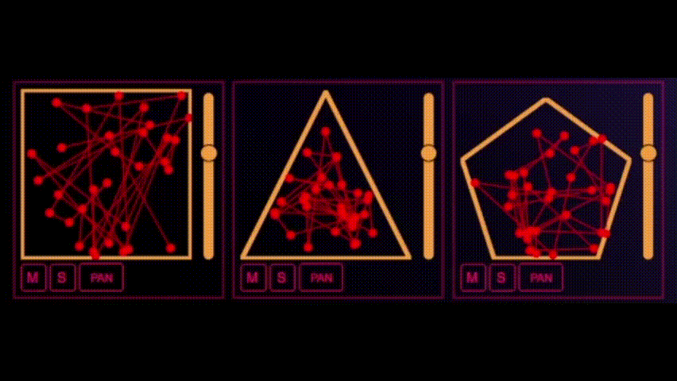

# Blob.

<p align="center">
  
</p>


<!--  -->

## General infos
---

Blob is a project developed for the course Advance Coding Tools and Methodologies, held in the Master degree of [Music and Acoustic Engineering](https://www.poliorientami.polimi.it/cosa-si-studia/corsi-di-laurea-magistrale/ingegneria/music-and-acoustic-engineering/), based in PoliMi. <br>
<br>
To run the project just type this line in the project folder: <br>
```
npm install
npx parcel src/prj.html --no-cache
```

The idea driving the project is the sonification of Kohonen Networks (KN). <br>

We implemented the following web frameworks: <br> 
- [Tone.js](https://tonejs.github.io/) <br>
- [Canvas API](https://developer.mozilla.org/en-US/docs/Web/API/Canvas_API) <br>
- [Bootstrap.js](https://getbootstrap.com/)<br>
- [SVG.js](https://svgjs.dev/docs/3.0/)<br>
- [Parcel API](https://parceljs.org/)<br>

**_The project is optimized for Mozilla Firefox._**

## Basic theoric notions
---
- ## Kohonen Algorhythm
KNs are a tool for visualize and convert high-dimensional data into simple geometric relationships on a low-dimensional display [1, 2].​ <br>

A KN enables to simulate the learning process that allows the brain to handle sensory perception (certain cortex areas have similar properties as KNs. Examples are the processing of sound and light stimuli) [3]. ​<br>

Notice: KNs are not a physical analogy of an expected neuronal configuration. They simply simulate the learning processing functions of certain areas of the brain cortex.​ <br>
​
- ## Kohonen Algorhythm Applications

### 1) RhythmPad

### 2) MelodicPad

### 3) HarmonicPAd


lo faccio dopo ingegneria del software.

 ## Files .js
 ---
In the [src](https://github.com/silviosgotto/progettoesame/tree/main/src) folder you will find seven .js files, aimed at different parts of the process of creation and sonification of the map. These are Main.js, HarmonicNeurons.js, HarmonicSound.js, melodicNeurons.js,MelodicSound.js, RhythmNeurons.js and RhythmSound.js. <br> 

### 1) [RhythmNeurons.js](https://github.com/silviosgotto/progettoesame/blob/main/src/RhythmNeurons.js)
This .js file has the function to handle the graphic part of the RhythmPads. <br>
We used the SVG.js web framework to draw and animate the map and the geometric shape (triangle, square or pentagone) in which it is placed. <br>
The _learning_ function applies kohonen algorhythm to the map.



### 2) [MelodicNeurons.js](https://github.com/silviosgotto/progettoesame/blob/main/src/MelodicNeurons.js)
This .js file has the function to handle the graphic part of the MelodicPad. <br>
We used the SVG.js web framework to draw and animate the map and the grid in which it is  placed. <br>
The _learning_ function applies kohonen algorhythm to the map. <br>

### 3) [HarmonicNeurons.js](https://github.com/silviosgotto/progettoesame/blob/main/src/HarmonicNeurons.js)
This .js file has the function to handle the graphic part of the HarmonicPad. <br>
We used the SVG.js web framework to draw and animate the map and the geometric shape (a circle) in which it is  placed. <br>
The _learning_ function applies Kohonen algorhythm to the map. <br>


### 4) [RhythmSound.js](https://github.com/silviosgotto/progettoesame/blob/main/src/RhythmSound.js)
This .js file has the function to elaborate the distances between the neuron-like elements (nodes) and generate a unique sequence of sounds. <br>
We used [Tone.js's Player](https://tonejs.github.io/docs/14.7.77/Player.html) to upload several samples (contained in the [sounds](https://github.com/silviosgotto/progettoesame/tree/main/sounds) folder) and play them.

### 5) [MelodicSound.js](https://github.com/silviosgotto/progettoesame/blob/main/src/MelodicSound.js)
This .js file has the function to elaborate the position and the distances between the neuron-like elements (nodes) and generate a unique sequence of sounds, using  [Tone.js's PolySynth](https://tonejs.github.io/docs/14.7.77/PolySynth).

### 6) [HarmonicSound.js](https://github.com/silviosgotto/progettoesame/blob/main/src/HarmonicSound.js)
This .js file has the function to elaborate the distances between the neuron-like elements (nodes) and generate a unique sequence of sounds based on the sequence of notes created by MelodicSound.js, using [Tone.js's PolySynth](https://tonejs.github.io/docs/14.7.77/PolySynth). 

### 7) [Main.js](https://github.com/silviosgotto/progettoesame/blob/main/src/main.js)
This .js file is the primary file, in which all the above-mentioned classes and the principal processes are initialized. <br>
Moreover, this file handles the main Tone.js properties that are modifiable during the execution of the application ([bpm](https://tonejs.github.io/docs/14.7.77/Transport), [Volume](https://tonejs.github.io/docs/14.7.77/Volume), [Pan](https://tonejs.github.io/docs/14.7.77/Panner), [Solo](https://tonejs.github.io/docs/14.7.77/Solo)). <br>


 


